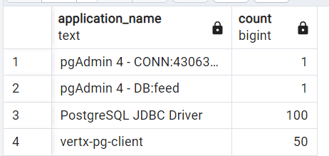
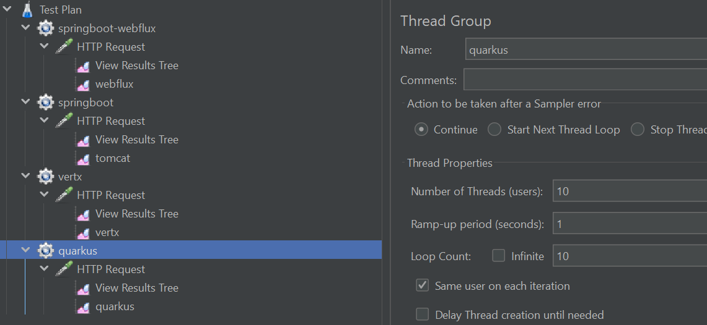
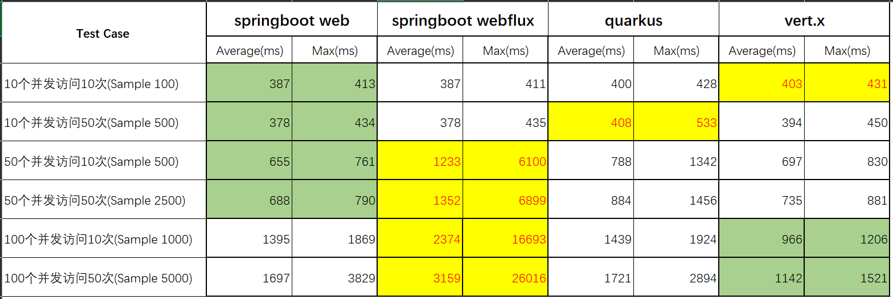

这一篇文章将对比通过不同方式创建的java应用程序的测试对比。

## 测试对象
- **Springboot Web**：springboot web应用。
- **Springboot Webflux**：springboot webflux应用。
- **Quarkus**：Redhat推出的一个更偏向容器的框架。
- **Origin**：基于Vert.x做的二次开发的一个框架。(源代码)[https://github.com/kxu913/origin]

## 测试条件
- 全部使用默认配置。
- 数据库连接池最大数设置为50，由于vert.x机制不同，所以不需要设置。
- 提供一个Http请求`/rss`接口，将从数据库查询100条记录。
  ```select * from rssentry order by publish_at desc limit 100```
- 数据库连接池都已创建。
  

## 测试plan
Jmeter同时执行4个http sample。


## 测试结果


## 问题
- springboot webflux在高并发情况下，性能下降很厉害，猜测跟默认的workgroup size偏小的缘故。
- 通过观察数据库连接，vertx会根据请求生成数据库连接，当有100个并发请求的时候，会生成100个数据库连接，但访问结束不会保留数据库连接，所以在数据库里看不到常驻的连接，而springboot和quarkus在数据库当中可以看到常驻连接数。而在需要创建数据库连接的情况下，表现跟springboot类似，猜测跟pgpool的reactor模式对数据库连接做了优化。


## 结论
- 总体来说，springboot web总体表现在默认配置下都是比较优秀的。
- 并发不高的情况下，springboot web和springboot webflux总体表现要比quarkus和vertx要好。
- 并发高的情况下，springboot webflux性能下降的很厉害。
- 在数据库线程池不足的情况下，vertx的表现要优化其他。

## 个人推荐

- Vert.x更偏向于原生的开发，在追求极致性能的情况下，推荐使用。
- 用Hotspot JVM情况下，推荐使用Springboot Web。
- 使用Native Image的情况下，推荐使用Quarkus，更容易集成。


